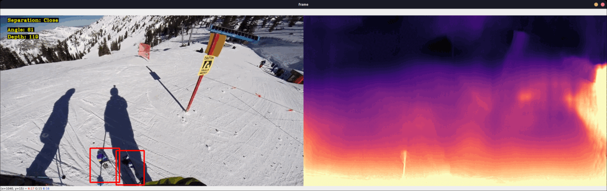

# YetiCoach ❄️
With just one action camera, YetiCoach elevates skiing analytics by delivering visual information regarding ski angles, separation, and depth analysis.
To give the athletes' coaches the finest data possible. 

## Features
- Realtime skii sepratation distance and skii angles.
- Depth Estimation for the path ahead using action cam footage.
- Interactive dashboard for valuable insights 

## Acknowledgements

 - [MonoDepth](https://github.com/nianticlabs/monodepth2)
 - [YOLOv5](https://github.com/ultralytics/yolov5)

## Authors

- [@shubhambaid](https://www.github.com/shubhambaid)
- [@jacksonsunny29](https://www.github.com/jacksonsunny29)

